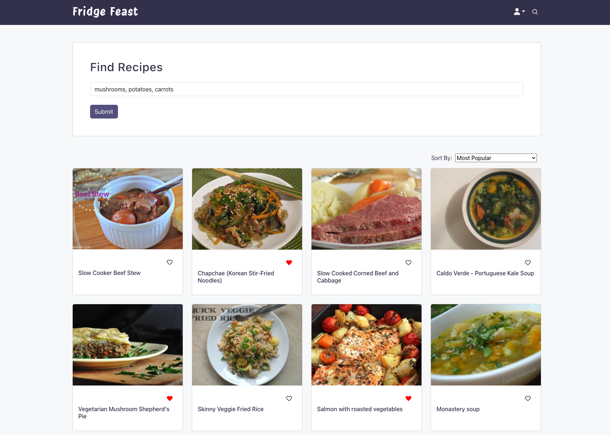
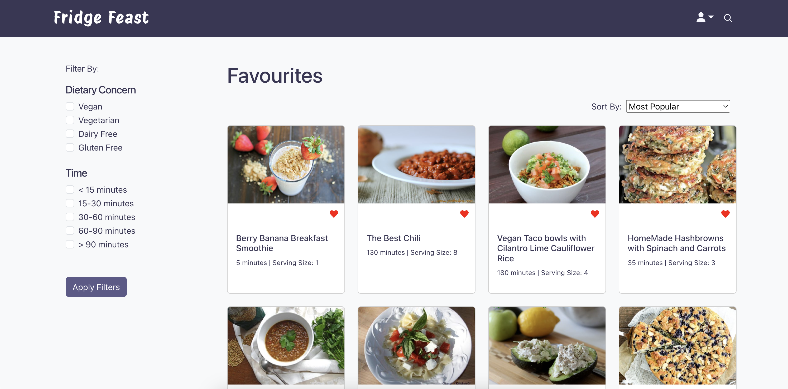
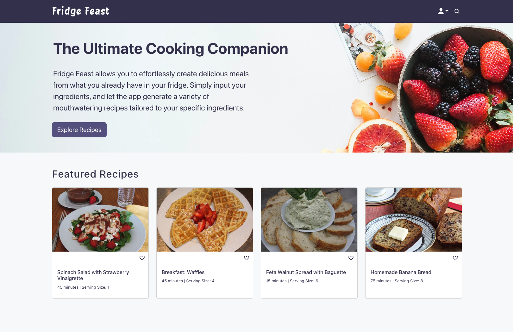

# Fridge Feast

Fridge Feast is a multi-page web app leveraging the [Spoonacular API](https://spoonacular.com/food-api) where users can input ingredients to generate personalized recipes tailored to their selections.

## Getting Started
Install dependencies with `npm install` in each respective `/frontend` and `/backend` folder.

## [Frontend] Run Webpack Development Server

```sh
cd frontend
npm run dev
```

## [Backend] Run Backend Server

```sh
cd backend
npm start
```

Go to http://127.0.0.1:5173/ in your browser to view the app.


## Project Features
**1. Search Recipes**

Users can input ingredients to search for tailored recipes using the specific search ingredients.




**2. Favourite Recipes**

Members can favourite recipes and view them on the favourites page. The favourites page can be filtered by dietary concerns and recipe time.




**3. Featured Recipes**

Utilize the Spoonacular API "Get Random Recipe" to populate random recipes under the Featured Recipes section of the homepage.



**4. User Accounts**

Users can create a personal account with additional user features for members only.  

  
